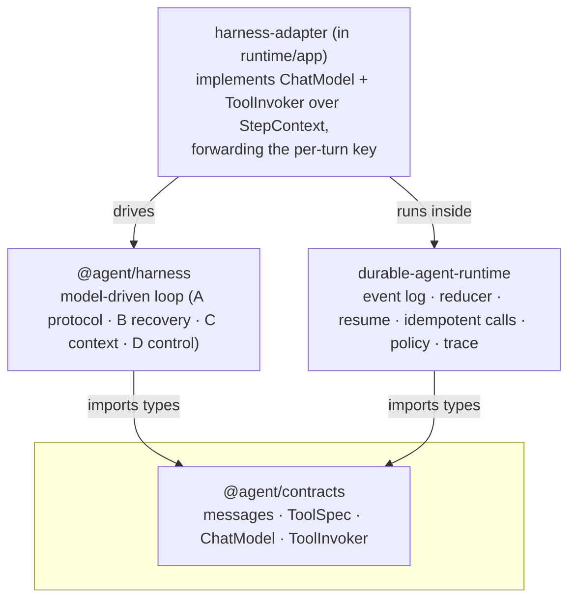

# Agent monorepo

A small monorepo exploring the **platform layer** beneath AI agents: a durable
execution runtime, a model-driven agent harness, and the shared contract that
lets them interoperate without depending on each other.

> The thesis: the hard part of a production agent isn't the business logic — it's
> what it runs *on*. This repo separates the **agent brain** (a model-driven
> loop) from the **execution substrate** (durability, resume, idempotency,
> observability, policy) and connects them through one tiny seam.

## The four projects

| Project | What it is | Depends on |
| --- | --- | --- |
| [`agent-contracts`](agent-contracts) | **The seam.** Pure types, zero logic: messages, tool specs, and the `ChatModel` / `ToolInvoker` interfaces both sides speak. | — |
| [`agent-harness`](agent-harness) | **The agent brain.** A model-driven loop: tool-calling protocol + arg validation (A), error recovery / self-healing (B), context & memory management (C), and control flow — planning, reflection, sub-agents, human-in-the-loop (D). Runtime-agnostic. | `@agent/contracts` |
| [`durable-agent-runtime`](durable-agent-runtime) | **The execution substrate.** Event-sourced, resumable, idempotent multi-phase execution with observability, cost accounting, a declarative policy layer, and a shared MCP base SDK. | `@agent/contracts`, `@agent/harness` |
| [`fabric-shell`](fabric-shell) | The real-world Copilot-CLI agent (MCP servers + skills + agent config) that motivated the study. | — (standalone tooling) |

Each of `agent-harness` and `durable-agent-runtime` has its own detailed README
([harness](agent-harness/README.md)) / README + [TESTING](durable-agent-runtime/TESTING.md).

## How they fit together



- The **harness** drives an abstract `ChatModel` + `ToolInvoker` and knows nothing
  about how it's hosted. A plain host can call `runAgent` directly.
- The **runtime** hosts it durably: a thin **adapter**
  ([harness-adapter.ts](durable-agent-runtime/src/app/harness-adapter.ts))
  implements those two contracts over the runtime's `StepContext`, forwarding the
  harness's per-turn **`key`** to `ctx.callModel` / `ctx.callTool`.
- That single forwarded `key` is the entire durability contract: every model turn
  and tool call is recorded in the event log and replayed idempotently on resume,
  so a crash mid-loop resumes **without re-running completed turns**.

The runtime still runs on its own too — a fixed 3-phase demo workflow and an
in-runtime model-driven demo loop — with the harness being fully opt-in.

## Run modes (durable-agent-runtime CLI)

| Mode | How | What runs |
| --- | --- | --- |
| Fixed workflow (default) | `agent run "<issue>"` | Code-driven `analyze → locate → propose` pipeline |
| In-runtime demo loop | `AGENT_LOOP=1 agent run "<issue>"` | A minimal model-driven loop built into the runtime |
| **Harness on the runtime** | `HARNESS=1 agent run "<issue>"` | The standalone `@agent/harness` loop, run as a durable step |

`*_CRASH_TURN=<n>` / `CRASH_AFTER=<stepId>` inject a crash to demo resume.

## Build & test

Everything is an npm workspace rooted here. First:

```powershell
npm install          # links @agent/contracts + @agent/harness across the workspace
```

Then:

```powershell
# contracts + harness
npm run build        # tsc: builds @agent/contracts, then @agent/harness
npm test             # builds contracts, then runs the harness test suite (43 tests)

# durable runtime (its own package tests)
npm test -w durable-agent-runtime            # 41 tests (incl. harness-integration)
npm run build -w durable-agent-runtime       # tsc

# harness offline demo (deterministic, no network)
npm run dev -w agent-harness

# harness running ON the runtime (durable), live:
$env:HARNESS='1'; npm run dev -w durable-agent-runtime -- run "Login page crashes with a null session"

# durability payoff — crash mid-loop, then resume without re-running tools:
$env:HARNESS='1'; $env:HARNESS_CRASH_TURN='1'; npm run dev -w durable-agent-runtime -- run "Login page crashes with a null session"
$env:HARNESS='1'; npm run dev -w durable-agent-runtime -- resume <run-id>
```

> Windows note: if a freshly-installed Node isn't on a terminal's PATH yet, refresh it with
> `$env:Path = [System.Environment]::GetEnvironmentVariable("Path","Machine") + ";" + [System.Environment]::GetEnvironmentVariable("Path","User")`.

## Layout

```
agent/                        # workspace root (this repo)
  agent-contracts/            # @agent/contracts — the shared seam (types only)
  agent-harness/              # @agent/harness — model-driven loop (A/B/C/D) + testkit + demo
  durable-agent-runtime/      # event-sourced durable runtime + app workload + harness adapter
  fabric-shell/               # the Copilot-CLI agent that inspired the study
  package.json                # npm workspaces: agent-contracts, agent-harness, durable-agent-runtime
```

## Design notes

- **Why a separate contracts package?** So neither core depends on the other. The
  harness stays host-agnostic; the runtime stays agent-agnostic. The connector
  (the adapter) is the only place that knows both.
- **Why is the whole loop one durable step?** Coarse but simple: per-turn
  idempotency keys (`t<turn>` / `t<turn>:<callId>`) make each model/tool call
  replayable, so the single step resumes deterministically. Finer-grained
  checkpointing is a possible evolution.
- **Untrusted tool output** is fenced and isolated by the harness's context layer
  (C) — tool results are data, never instructions (prompt-injection defence).
