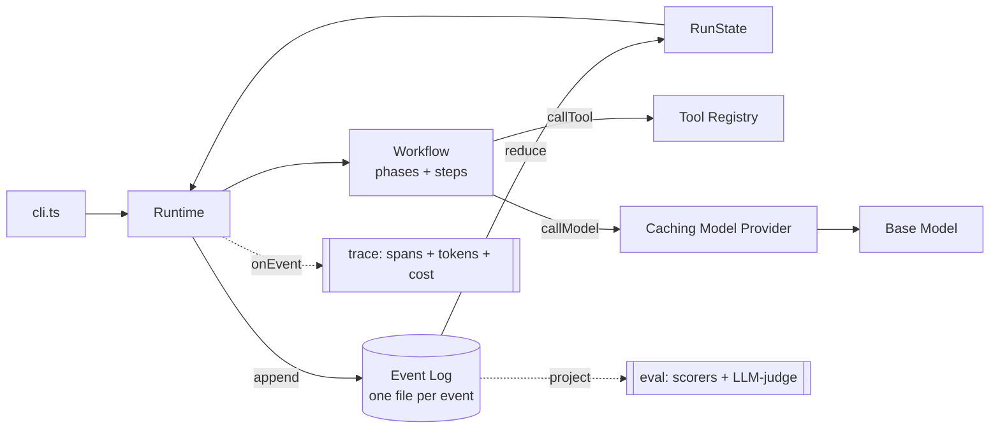

# durable-agent-runtime

A small, dependency-light **agent runtime** that makes multi-phase LLM agents
**durable and resumable** — inspired by studying a production agent, then
rebuilding the *platform layer* underneath it with stronger guarantees.

> The demo workload (an issue → fix agent) is deliberately thin. The point of
> this project is the **runtime**: event-sourced state, crash-safe resume,
> idempotent tool calls, and a pluggable model provider.

---

## Why this exists

Many agents persist progress by **overwriting a single snapshot** file (a
"checkpoint"). That works until two things happen: a crash mid-write, or a tool
side effect that you don't want to repeat on resume. This runtime takes the
event-sourcing approach instead:

| Concern | Snapshot / overwrite checkpoint | This runtime (event-sourced) |
|---|---|---|
| Persistence | Overwrite one JSON blob | Append-only event log, one exclusively-created file per event |
| State | Stored directly (can be half-written) | **Derived** by folding events through a pure reducer |
| Crash safety | Partial write can corrupt state | A crash leaves a valid, replayable **prefix** |
| Resume | Re-run from a coarse "phase/step" marker | Replay log → continue at first incomplete step |
| Repeated side effects | Tools re-run on resume | **Idempotent**: completed tool calls are replayed, not re-executed |
| Auditability | Last state only | Full ordered history (time-travel / debugging) |

---

## Architecture



- **Event log** ([src/eventlog.ts](src/eventlog.ts)) — append-only; one exclusively-created file per event (optimistic concurrency).
- **Reducer** ([src/reducer.ts](src/reducer.ts)) — pure `(state, event) => state`; the only way state is built.
- **Runtime** ([src/runtime.ts](src/runtime.ts)) — drives the workflow, appends events, resumes from the log, and makes tool calls idempotent via deterministic `callId`s.
- **Workflow** ([src/workflow.ts](src/workflow.ts)) — declarative phases/steps (`analyze → locate → propose`).
- **Model provider** ([src/model/provider.ts](src/model/provider.ts)) — swappable LLM; the mock is deterministic for offline dev and stable tests.
- **Response cache** ([src/model/caching.ts](src/model/caching.ts)) — `CachingModelProvider` decorator: content-keyed (normalized prompt → sha256), LRU-bounded, optionally file-backed. Cuts tokens/cost on repeated prompts across runs.
- **Pricing** ([src/pricing.ts](src/pricing.ts)) — config-driven token pricing (`agent.config.json`); feeds the cost totals in the trace.
- **Tools** ([src/tools/registry.ts](src/tools/registry.ts)) — MCP-shaped tool defs; deterministic mocks for the demo.
- **Eval** ([src/eval.ts](src/eval.ts)) — scenario fixtures + composable scorers (programmatic + LLM-as-judge) that grade the derived RunState/trace; `agent eval` exits non-zero on a regression.

---

## Quickstart

```bash
npm install
npm run build
npm test          # includes the crash-and-resume durability test

# Run the agent
npm run dev -- run "Login page crashes with a null session"
```

### Demo: crash, then resume (the whole point)

```bash
# 1. Force a crash right after the code-search step. Note the printed run id.
CRASH_AFTER=locate.1 npm run dev -- run "Login page crashes with a null session"

# 2. Resume — it replays the log, skips completed work, does NOT re-run the
#    already-successful searchCode tool, and finishes.
npm run dev -- resume <run-id>

# 3. Inspect the derived state at any time.
npm run dev -- status <run-id>
```

Each run is a directory of sequence-numbered event files (one JSON per event):

```bash
ls .agent-runs/<run-id>/   # 000000000000.json, 000000000001.json, ...
```

---

## Design decisions worth explaining (interview notes)

1. **State is derived, never stored.** The reducer is pure, so the same log
   always rebuilds the same state. Resume is "replay to head, continue."
2. **Idempotent tool calls.** Each call gets a deterministic id
   (`<phase>.<step>:<tool>`). If the log already has its result, the runtime
   replays it instead of re-invoking the tool — so resuming never repeats a side
   effect that already happened.
3. **The crash is injected *between* the side effect and the completion event.**
   That is the exact window a naive checkpoint gets wrong; the test asserts we
   get it right.
4. **The model is a dependency, not a hardcoded call.** A deterministic mock
   enables offline runs, reproducible logs, and non-flaky evals.
5. **`onEvent` is an observability seam.** Every state transition flows through
   one place — the natural hook for tracing, token/cost accounting, and metrics.
6. **Two cache layers, on purpose.** Durable *replay* (per-run, keyed by log
   position) guarantees resume never repeats work; a separate *content* cache
   (cross-run, keyed by a normalized prompt hash) cuts cost on repeated prompts.
   They solve different problems and compose.
7. **Eval is just another projection.** Scorers read the same event-sourced
   RunState/trace a run already produces, so grading is "read the history." Evals
   run on a fresh, un-cached model so a stale cache can't mask a regression.

---

## Roadmap

- **D2 — Durability core** ✅ event log + reducer + resume + idempotency (this commit).
- **D3 — Concurrency safety** ✅ optimistic-concurrency append (exclusive-create) + `ConflictError` + a `recover()` supervisor.
- **D4 — Observability** ✅ per phase/step/tool/model spans + token/cost/latency totals via `agent trace`; model calls now flow through the runtime (recorded as `ModelCalled` events + idempotent on resume).
- **D5 — Eval harness** ✅ scenario fixtures + composable scorers (programmatic + LLM-as-judge) grading the RunState/trace; `agent eval` (exits non-zero on failure). Demo: `AGENT_REGRESS=1 agent eval` degrades a prompt → the harness catches the regression.
- **D6 — Polish** ✅ architecture write-up (this file) + refreshed [TESTING.md](TESTING.md) + a scripted end-to-end walkthrough ([demo.ps1](demo.ps1): run → crash → resume → recover → trace → eval).

## License

MIT
