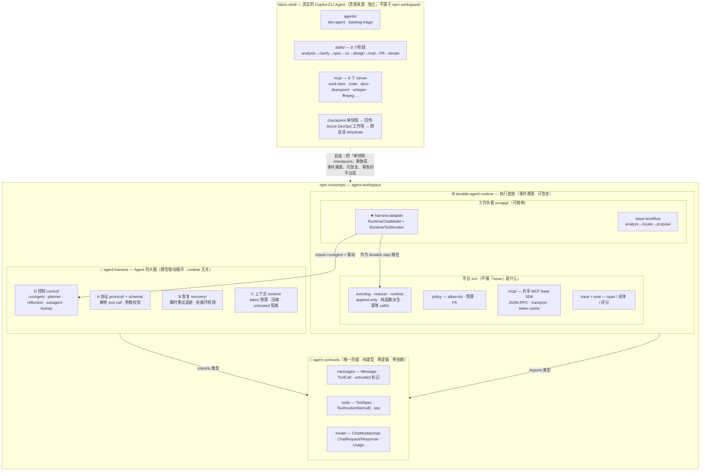
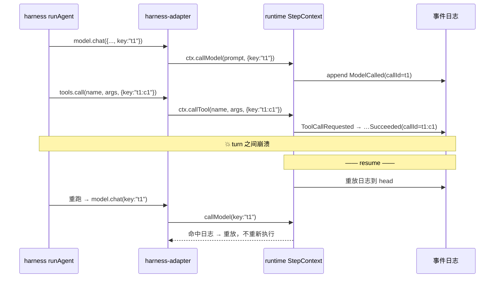
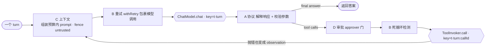
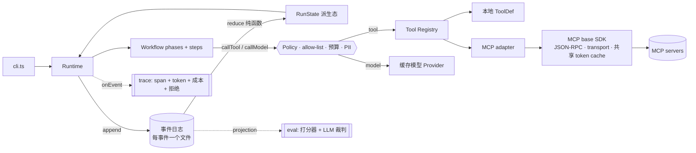

# Agent monorepo

一个探索 AI Agent **平台层**的小型 monorepo：一个可持久化的执行运行时、一个模型驱动的
Agent harness，以及让两者在互不依赖的前提下协作的共享契约。

> 立意：一个生产级 Agent 的难点不在业务逻辑，而在它**运行的底座**。本仓库把
> **Agent 的大脑**（模型驱动循环）和**执行底座**（持久化、恢复、幂等、可观测、策略）
> 拆开，再用一条极小的缝 (seam) 把它们连起来。

## 四个 project

| Project | 是什么 | 依赖 |
| --- | --- | --- |
| [`agent-contracts`](agent-contracts) | **缝 (seam)。** 纯类型、零逻辑：messages、tool spec，以及两侧都遵循的 `ChatModel` / `ToolInvoker` 接口。 | — |
| [`agent-harness`](agent-harness) | **Agent 的大脑。** 一个模型驱动循环：工具调用协议 + 参数校验 (A)、错误恢复 / 自愈 (B)、上下文与记忆管理 (C)，以及控制流——规划、反思、子 Agent、human-in-the-loop (D)。与运行时无关。 | `@agent/contracts` |
| [`durable-agent-runtime`](durable-agent-runtime) | **执行底座。** 事件溯源、可恢复、幂等的多阶段执行，带可观测性、成本核算、声明式策略层，以及一个共享的 MCP base SDK。 | `@agent/contracts`、`@agent/harness` |
| [`fabric-shell`](fabric-shell) | 启发整个研究的真实 Copilot-CLI Agent（MCP servers + skills + agent 配置）。 | —（独立工具） |

`agent-harness` 与 `durable-agent-runtime` 各自有详细的 README
（[harness](agent-harness/README.md) / README + [TESTING](durable-agent-runtime/TESTING.md)）。

## 总体架构

整套仓库的核心是：把 **Agent 的大脑**（`agent-harness`）和**执行底座**（`durable-agent-runtime`）
彻底拆开，中间只用一个零依赖的纯类型契约包（`agent-contracts`）作为唯一的缝。`fabric-shell`
是启发整个研究的真实产品——它用「单快照 checkpoint」实现跨会话续跑，本仓库把那一层重做成了
事件溯源、可恢复、幂等的平台层。



- **harness** 驱动一个抽象的 `ChatModel` + `ToolInvoker`，完全不知道自己被谁托管；
  普通宿主可以直接调用 `runAgent`。
- **runtime** 把它持久化托管：一个很薄的**适配器**
  （[harness-adapter.ts](durable-agent-runtime/src/app/harness-adapter.ts)）在 runtime 的
  `StepContext` 上实现这两个契约，把 harness 每一步的 **`key`** 原样转发给
  `ctx.callModel` / `ctx.callTool`。
- **依赖方向是关键**：`harness` 和 `runtime` 谁都不依赖对方，只各自依赖 `contracts`。这样
  大脑保持「宿主无关」、底座保持「Agent 无关」，只有 adapter 这一个地方同时认识两边。

runtime 也能完全独立运行——支持三种执行模式：固定工作流（默认）、内置 agent 循环（`AGENT_LOOP=1`）、
以及托管 harness 循环（`HARNESS=1`）。harness 是完全可选的。

## 缝的本质：一个 `key` 就是整个持久化契约

harness 每一步生成一个确定性的 `key`（模型用 `t<turn>`，工具用 `t<turn>:<callId>`），adapter
原封不动地转发给 runtime，runtime 就能把每次模型/工具调用记录到事件日志、在恢复时幂等重放——已完成的
turn 与工具副作用不会重复执行。



子 Agent 会扩展 `keyPrefix`（如 `t1:p1:t1:s1`），保证嵌套下 key 全局唯一。

## 每个 project 的功能模块

### 🔌 agent-contracts — 缝（纯类型）

| 模块 | 职责 |
| --- | --- |
| [messages.ts](agent-contracts/src/messages.ts) | 工具调用对话记录：`Message` / `ToolCall` / `Role`，构造函数 `systemMessage` / `userMessage` / `assistantMessage` / `toolResultMessage`，以及 `untrusted` 标记（防注入的关键设计）。 |
| [tools.ts](agent-contracts/src/tools.ts) | `JSONSchema` 子集 · `ToolSpec` · `ToolInvoker`（`list` / `call`）· 带 `key` 的 `CallOptions`。 |
| [model.ts](agent-contracts/src/model.ts) | `ChatModel`（`chat`）· `ChatRequest` / `ChatResponse` · `Usage` · `StopReason`。 |

### 🧠 agent-harness — Agent 的大脑（A / B / C / D 四层）

| 层 | 模块 | 职责 |
| --- | --- | --- |
| **A 协议** | [protocol/tool-calling.ts](agent-harness/src/protocol/tool-calling.ts) · [schema/validate.ts](agent-harness/src/schema/validate.ts) | 把 `ChatResponse` 解释成已校验的 tool call 或最终答案；执行**前**按各工具的 `inputSchema` 校验参数——非法调用变成结构化错误而非崩溃；内置一个为不支持原生 tool-calling 的模型准备的容错文本解析器。 |
| **B 恢复** | [recovery/retry.ts](agent-harness/src/recovery/retry.ts) · [recovery/loop-detector.ts](agent-harness/src/recovery/loop-detector.ts) | 只对**瞬时性**失败执行退避重试（HTTP 429/5xx 分类 + `Retry-After` 头 + 指数退避 + full jitter）；把工具抛出的异常转化为模型能理解的 observation；检测无进展的死循环——包括单次重复调用和重复序列模式（A→B→A→B）。 |
| **C 上下文** | [context/manager.ts](agent-harness/src/context/manager.ts) | 在 token 预算内组装 prompt + 滚动压缩（保留 system + 近期消息，其余压缩为摘要）、observation 截断、**untrusted 输出隔离**（工具结果只当数据、绝不当指令）。 |
| **D 控制** | [control/loop.ts](agent-harness/src/control/loop.ts) · [planner.ts](agent-harness/src/control/planner.ts) · [reflection.ts](agent-harness/src/control/reflection.ts) · [subagent.ts](agent-harness/src/control/subagent.ts) · [human.ts](agent-harness/src/control/human.ts) | 核心 `runAgent` 循环，加上 `runPlannedAgent`（先规划后执行）、`runReflectiveAgent`（自我批评并修订）、`makeSubagentTool`（把子任务委派封装成一个工具）、以及 human-in-the-loop 的 `Approver`。 |

另外：`tracing/collector.ts`（结构化 trace：token 用量统计、每次调用的成本估算、每 turn 决策记录）+ `testkit/`（确定性的 `ChatModel` / `ToolInvoker` 测试替身）+ `demo.ts`（可离线运行的 demo）。

一次 turn 内 A / B / C / D 如何协作：



### ⚙️ durable-agent-runtime — 执行底座（平台 vs 工作负载）

边界很清晰：`src/` 下的一切是**平台（runtime）**，完全不懂「issue / fix」；`src/app/` 下的
一切是**demo 工作负载**，可整体替换而不动 runtime。

**平台 `src/`**

| 模块 | 职责 |
| --- | --- |
| [eventlog.ts](durable-agent-runtime/src/eventlog.ts) | append-only；每个事件一个独占创建的文件（乐观并发）。 |
| [reducer.ts](durable-agent-runtime/src/reducer.ts) | 纯函数 `(state, event) => state`，唯一构建状态的途径。 |
| [runtime.ts](durable-agent-runtime/src/runtime.ts) | 驱动工作流、追加事件、从日志恢复，用确定性 `callId` 让工具调用幂等。 |
| [workflow.ts](durable-agent-runtime/src/workflow.ts) | `WorkflowDef` / `PhaseDef` / `StepDef` / `StepContext` 契约——描述工作流长什么样。 |
| [types.ts](durable-agent-runtime/src/types.ts) | `AgentEvent`（所有事件类型）+ 派生态 `RunState`（永不落盘，靠 reducer 重建）。 |
| [model/provider.ts](durable-agent-runtime/src/model/provider.ts) · [model/caching.ts](durable-agent-runtime/src/model/caching.ts) | 可换的模型 provider + 内容寻址的响应缓存装饰器。 |
| [pricing.ts](durable-agent-runtime/src/pricing.ts) | 配置驱动（`agent.config.json`）的 token 定价，供成本核算使用。 |
| [tools/registry.ts](durable-agent-runtime/src/tools/registry.ts) | 遵循 MCP 规范的 `ToolDef` / `ToolRegistry`——本地工具和远程 MCP 工具在 runtime 眼里一模一样。 |
| [policy.ts](durable-agent-runtime/src/policy.ts) | 声明式护栏（工具 allow-list · 成本预算 · PII 脱敏）；拒绝操作记录为 `PolicyDenied` 事件，可观测、可 eval。 |
| [mcp/](durable-agent-runtime/src/mcp/index.ts) | 共享 MCP base SDK：JSON-RPC 框架、可换 transport、**共享**的 token cache；adapter 把 server 的工具投影进 `ToolRegistry`。 |
| [snapshot.ts](durable-agent-runtime/src/snapshot.ts) | 周期性派生状态快照 checkpoint，用于快速恢复（原子写入 + 完整性校验；损坏则回退到事件重放）。 |
| [trace.ts](durable-agent-runtime/src/trace.ts) · [eval.ts](durable-agent-runtime/src/eval.ts) | phase / step / tool / model 各级 span + token / 成本 / 延迟，含重放命中率统计；可组合的打分器（含 LLM 裁判）。 |
| [cli.ts](durable-agent-runtime/src/cli.ts) | 命令行入口：`run` / `resume` / `status` / `recover` / `trace` / `eval`；通过环境变量切换多种执行模式。 |
| [agent-loop.ts](durable-agent-runtime/src/agent-loop.ts) | runtime 内置的模型驱动 Agent 循环（比 harness 更简单，但核心概念相同），封装为单个 durable step。 |

**工作负载 `src/app/`**

| 模块 | 职责 |
| --- | --- |
| [harness-adapter.ts](durable-agent-runtime/src/app/harness-adapter.ts) | ★ **关键集成**：`RuntimeChatModel` + `RuntimeToolInvoker` 在 `StepContext` 上实现契约并转发 `key`；`createHarnessWorkflow` 把 `runAgent` 包成单个 durable step。 |
| [issue-workflow.ts](durable-agent-runtime/src/app/issue-workflow.ts) | demo 的 `issue → fix` Agent，声明为 `analyze → locate → propose` 三阶段。 |
| [tools.ts](durable-agent-runtime/src/app/tools.ts) · [mcp-servers.ts](durable-agent-runtime/src/app/mcp-servers.ts) · [responses.ts](durable-agent-runtime/src/app/responses.ts) · [scenarios.ts](durable-agent-runtime/src/app/scenarios.ts) · [agent-scenario.ts](durable-agent-runtime/src/app/agent-scenario.ts) | 确定性的 mock 工具 / 模型响应、通过 MCP base SDK 暴露同一批工具的封装、eval 测试场景、内置 agent 循环的 mock 模型大脑。 |

状态永远是「算出来的」，不是「存下来的」：



### 📦 fabric-shell — 灵感来源（独立 Copilot-CLI 插件）

| 模块 | 职责 |
| --- | --- |
| `agents/` | [dev-agent](fabric-shell/agents/fabric-shell-dev-agent.md)（工作项端到端处理）、[backlog-triage-agent](fabric-shell/agents/fabric-shell-backlog-triage-agent.md)。 |
| `skills/` | 8 个阶段各一个 skill：work-item-analysis → clarification → pm-spec → ux-design → dev-design → dev-implementation → pr-submission → pr-iteration。 |
| `mcp/` | 8 个 MCP server：work-item · code · docx · sharepoint · openai-whisper · ffmpeg · fabric-docs · checkpoint。 |
| [hooks.json](fabric-shell/hooks.json) + [hooks/flush-checkpoint.js](fabric-shell/hooks/flush-checkpoint.js) | checkpoint 落盘 hook。 |
| [checkpoint-schema.json](fabric-shell/checkpoint-schema.json) | 单快照 checkpoint，回传 Azure DevOps 工作项，实现跨会话 / 跨机器 rehydrate——正是这个「单快照」设计启发了 runtime 的事件溯源重做。 |

## 运行模式（durable-agent-runtime CLI）

### Agent 执行模式

| 模式 | 命令 | 跑的是什么 |
| --- | --- | --- |
| 固定工作流（默认） | `npm run dev -- run "<issue>"` | 代码驱动的 `analyze → locate → propose` 流水线 |
| runtime 内置循环 | `AGENT_LOOP=1 npm run dev -- run "<issue>"` | runtime 内置的模型驱动循环（`agent-loop.ts`） |
| **harness 跑在 runtime 上** | `HARNESS=1 npm run dev -- run "<issue>"` | 独立的 `@agent/harness` 四层循环，作为 durable step 运行 |

### 持久化与可观测性命令

| 命令 | 作用 |
| --- | --- |
| `npm run dev -- resume <run-id>` | 从事件日志恢复并继续未完成的 run |
| `npm run dev -- status <run-id>` | 查看派生 RunState |
| `npm run dev -- recover <run-id>` | 修复因乐观并发冲突而卡住的 run |
| `npm run dev -- trace <run-id>` | 查看 span 时间线 + token / 成本 / 延迟汇总 |
| `npm run dev -- eval` | 跑 eval 场景，回归时非零退出 |

### 环境变量开关

| 变量 | 作用 |
| --- | --- |
| `HARNESS=1` | 使用 harness 四层循环替代固定工作流 |
| `AGENT_LOOP=1` | 使用 runtime 内置 agent 循环 |
| `AGENT_MCP=1` | 通过 MCP base SDK（JSON-RPC + 共享 token cache）提供 demo 工具 |
| `AGENT_REGRESS=1` | 故意降级模型输出质量，用于验证 eval 框架能否捕获回归 |
| `CRASH_AFTER=<phase.step>` | 在指定 step 后注入崩溃，测试恢复能力 |

`*_CRASH_TURN=<n>` / `CRASH_AFTER=<stepId>` 用于注入崩溃以演示恢复。

## 构建与测试

一切都是以这里为根的 npm workspace。首先：

```powershell
npm install          # 在整个 workspace 中链接 @agent/contracts + @agent/harness
```

然后：

```powershell
# contracts + harness
npm run build        # tsc：先构建 @agent/contracts，再构建 @agent/harness
npm test             # 先构建 contracts，再跑 harness 测试套件（43 个测试）

# durable runtime（它自己的包测试）
npm test -w durable-agent-runtime            # 41 个测试（含 harness-integration）
npm run build -w durable-agent-runtime       # tsc

# harness 离线 demo（确定性，无网络）
npm run dev -w agent-harness

# harness 跑在 runtime 上（持久化），实时：
$env:HARNESS='1'; npm run dev -w durable-agent-runtime -- run "Login page crashes with a null session"

# 持久化的回报——循环中途崩溃，恢复时不重跑已完成的工具：
$env:HARNESS='1'; $env:HARNESS_CRASH_TURN='1'; npm run dev -w durable-agent-runtime -- run "Login page crashes with a null session"
$env:HARNESS='1'; npm run dev -w durable-agent-runtime -- resume <run-id>
```

> Windows 提示：如果刚装好的 Node 还没进入某个终端的 PATH，用下面这行刷新：
> `$env:Path = [System.Environment]::GetEnvironmentVariable("Path","Machine") + ";" + [System.Environment]::GetEnvironmentVariable("Path","User")`

## 目录结构

```
agent/                        # workspace 根（本仓库）
  agent-contracts/            # @agent/contracts — 共享的缝（仅类型）
  agent-harness/              # @agent/harness — 模型驱动循环 (A/B/C/D) + testkit + demo
  durable-agent-runtime/      # 事件溯源的持久化 runtime + app 工作负载 + harness adapter
  fabric-shell/               # 启发本研究的 Copilot-CLI Agent
  package.json                # npm workspaces：agent-contracts、agent-harness、durable-agent-runtime
```

## 设计说明

- **为什么单独抽一个 contracts 包？** 让两个核心谁都不依赖对方。harness 保持宿主无关、
  runtime 保持 Agent 无关，只有连接器（adapter）同时认识两边。
- **为什么整个循环是一个 durable step？** 粗但简单：每步的幂等 key（`t<turn>` /
  `t<turn>:<callId>`）让每次模型/工具调用可重放，所以这单个 step 能确定性地恢复。更细
  粒度的 checkpoint 是可能的演进方向。
- **untrusted 工具输出**被 harness 的上下文层 (C) fence 和隔离——工具结果是数据，绝不是
  指令（防 prompt injection）。
