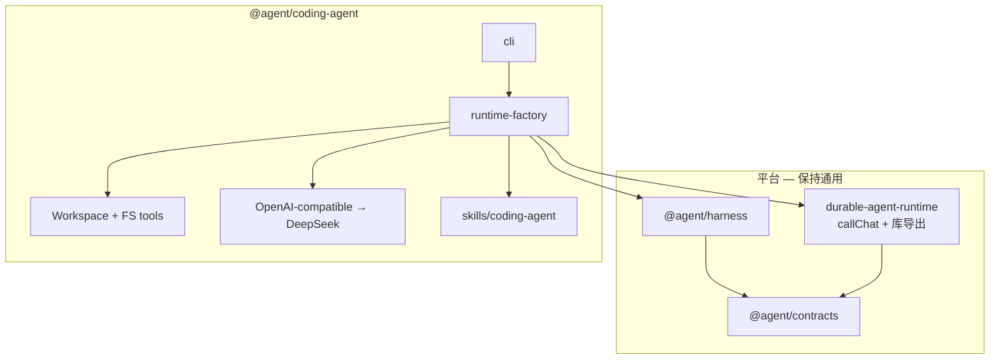

# Coding Agent — 开发设计与接手指南

本文档把「为什么做 / 怎么设计 / 现在做到哪 / 下一步」写在 `@agent/coding-agent` 包内，方便新 session 直接接着干。  
实现细节以源码为准；本文偏决策与地图。

---

## 1. 目标定位

| 项 | 选择 |
| --- | --- |
| 形态 | **沙箱 Coding Agent（阶段 A）**：分析 → 改代码 → 写文档 |
| 演进 | 工具按 `workspaceRoot` 注入；CLI `--workspace` / UI 路径 / `AGENT_WORKSPACE` 即可指向任意仓 |
| 工程边界 | **独立 npm workspace** `@agent/coding-agent`，不把业务塞进 harness / durable-runtime |
| 解耦含义 | 包边界解耦 + **单向依赖平台**（仍用 harness + runtime 做 durable 验证）；**不是**零依赖自建循环 |
| LLM | **DeepSeek**（OpenAI 兼容协议）；`DEEPSEEK_API_KEY` |

**非目标（阶段 A）：** IDE 插件、任意 shell、git/PR、MCP、默认改整个 monorepo。

---

## 2. 架构关系



- **平台职责：** durable 事件日志、policy、`callChat` / `callModel` / `callTool` 漏斗（现位于 `durable-agent-runtime/src/step-context.ts`）、`createHarnessWorkflow`。
- **本包职责：** workspace 沙箱、读写工具、`run_tests`、DeepSeek provider、skill、CLI、默认 fixture。

---

## 3. 关键设计：`callChat`

| 缝 | 输入/输出 | 用途 |
| --- | --- | --- |
| `callModel` | 文本 → 文本 | 旧 demo / 文本桥；adapter 用 `parseTextToolCall` |
| **`callChat`** | `messages`+`tools` → 结构化 `ChatResponse` | DeepSeek native tool-calling；**按 key 落日志并可 resume 重放** |

**不要**在 adapter 里绕过 Runtime 直接打 API——否则崩溃续跑会重复调模型。

Harness adapter（`RuntimeChatModel`）：

- 有 `ctx.callChat` → **直接返回** ChatResponse（**不再**走 `parseTextToolCall`）
- 否则 → 旧文本桥：`callModel` + `parseTextToolCall`

Chat 结果以 JSON envelope 存在 `ModelCalled.response`（`kind: 'chat'`），见 `model/chat-provider.ts`。

---

## 4. 本包模块地图

| 路径 | 职责 |
| --- | --- |
| `src/cli.ts` | 独立 CLI：`run` / `resume` / `status` / `trace`；`--workspace` / `-W` |
| `src/ui-server.ts` + `ui/static/` | 本地 Workbench：SSE 跑 agent、Analysis、unified diff |
| `src/workspace-diff.ts` | run 前后快照与 unified diff |
| `src/runtime-factory.ts` | 组装 Workspace、工具、skill、approver、Runtime |
| `src/workspace.ts` | 路径沙箱（防 `..` 逃逸） |
| `src/tools/fs-tools.ts` | `list_dir` / `grep` / `read_file` / `write_file` |
| `src/tools/run-tests.ts` | 白名单 `npm test` |
| `src/model/openai-compatible.ts` | DeepSeek 默认的兼容 Chat provider |
| `src/stdin-approver.ts` | `write_file` HITL |
| `skills/coding-agent/SKILL.md` | Analyze → Edit(+test) → Document |
| `fixtures/coding-sandbox/` | 默认试跑仓（故意 null-session bug） |
| `agent.config.json` | pricing + policy allow-list |
| `test/` | workspace 单测 + 脚本化 E2E |

平台相关（不在本包，但接手时要知道）：

| 路径 | 职责 |
| --- | --- |
| `durable-agent-runtime/src/step-context.ts` | 从 Runtime 拆出的 callModel/callChat/callTool |
| `durable-agent-runtime/src/model/chat-provider.ts` | Chat envelope 编解码 |
| `durable-agent-runtime/src/index.ts` | 对外部宿主的库导出 |
| `durable-agent-runtime/src/app/harness-adapter.ts` | harness ↔ Runtime 桥 |

---

## 5. 工具与安全（阶段 A）

| 工具 | 说明 |
| --- | --- |
| `list_dir` / `grep` / `read_file` | 只读，限制匹配数/字符 |
| `write_file` | 整文件写；内容幂等；默认 **stdin HITL** |
| `run_tests` | 仅白名单 `npm test`，无任意 shell |

- 默认 workspace：`fixtures/coding-sandbox`；覆盖：`--workspace` / UI path / `AGENT_WORKSPACE`
- 快照 / `list_dir` / `grep` 遵守根目录 `.gitignore` + 硬默认（`node_modules`、`.git`、`.coding-agent-runs`、`dist`）
- 自动批准写：`AGENT_AUTO_APPROVE=1`
- Policy allow-list 在 `agent.config.json` / `defaultCodingPolicy()`

---

## 6. LLM 环境变量

| 变量 | 含义 |
| --- | --- |
| `DEEPSEEK_API_KEY`（或 `LLM_API_KEY`） | 必填才能 live |
| `DEEPSEEK_BASE_URL` / `LLM_BASE_URL` | 默认 `https://api.deepseek.com` |
| `DEEPSEEK_MODEL` / `LLM_MODEL` | 默认 `deepseek-chat`；用于查 context 窗口并算 soft cap |
| `AGENT_MAX_PROMPT_TOKENS` | 产品 soft cap 覆盖（默认 128000）；最终 `min(modelWindow, softCap)` |
| `AGENT_WORKSPACE` | 工作区 root |
| `AGENT_AUTO_APPROVE` | `1` 跳过 write 审批 |
| `AGENT_RUNS_DIR` | 默认 `.coding-agent-runs` |
| `AGENT_MAX_TURNS` / `HARNESS_CRASH_TURN` | 控制 / 注入崩溃 |

---

## 7. 怎么跑

```bash
# 从 monorepo 根
npm install
npm run build

# 离线测试（脚本化模型，不打网）
npm test -w @agent/coding-agent

# Live DeepSeek
export DEEPSEEK_API_KEY=...
export AGENT_AUTO_APPROVE=1   # 试跑可先开
npm run dev -w @agent/coding-agent -- "Fix getUserName null session, run tests, write ANALYSIS.md"

# 任意本地仓库
npm run dev -w @agent/coding-agent -- --workspace /path/to/repo "Summarize src/"
```

Fixture 需求见 `fixtures/coding-sandbox/REQUIREMENT.md`。

---

## 8. 已完成 / 未完成

### 已完成

- [x] Runtime `callChat` + envelope + 库导出
- [x] `step-context.ts` 从 `makeContext` 拆出漏斗逻辑
- [x] `@agent/coding-agent` 包、工具、skill、fixture、CLI
- [x] DeepSeek 兼容 provider
- [x] 脚本化 E2E（修 bug + 写 `ANALYSIS.md`）
- [x] `write_file` HITL / auto-approve 开关

### 建议下一步（接手时可选）

- [x] **Workbench UI** — `npm run ui`：goal / 事件流 / ANALYSIS / code diff / reset fixture；**可填任意 repo path**
- [x] CLI `--workspace <path>`（与 UI 对齐；短旗 `-W`，避免与 npm `-w` 冲突）
- [x] `.gitignore` 感知快照 / walk（`list_dir`、`grep`、UI diff）
- [x] UI **Trace** 页：runtime `buildTrace` + harness `TraceCollector`（cost / duration / cache / retry）
- [ ] **统一配置文件**（见仓库 `docs/TODO.md` §2）
- [x] EventLog 乐观并发可关 → 单 run 单文件（`RuntimeOptions.eventLog.optimisticConcurrency: false`）
- [ ] UI：Session / crash / resume / pause / HITL（`docs/TODO.md` §3）
- [ ] UI：手动调 max prompt tokens（`docs/TODO.md` §4）
- [ ] 真机调优；UI 可继续增强（流式 token、多文件侧栏、嵌套 `.gitignore`）
- [ ] `apply_patch`、受限 git、更丰富 HITL UX
- [ ] 代码 review 通过后，再按仓库 skill 更新根 README / cheatsheet 等正式文档

---

## 9. 设计决策速查（避免新 session 重辩）

1. **先 A（固定默认 workspace）再通用** — 浪费小，只要 root 一直是注入的。  
2. **不做薄 Docs Q&A** — 压不到 durable 写副作用；coding 三阶段更贴框架差异化。  
3. **`write_file` 而非首版 `apply_patch`** — 沙箱文件小，整文件写更简单。  
4. **Skill eager** — 阶段 A 把 playbook 打进 instructions，少一轮 `skill_read`。  
5. **正式 monorepo 文档** — 等用户签过实现后再改根 README 等（仓库 agent skill）。

---

## 10. 相关文件（快速打开）

- 本包工厂：[`../src/runtime-factory.ts`](../src/runtime-factory.ts)
- 本包 CLI：[`../src/cli.ts`](../src/cli.ts)
- Skill：[`../skills/coding-agent/SKILL.md`](../skills/coding-agent/SKILL.md)
- 仓库 backlog：[`../../docs/TODO.md`](../../docs/TODO.md)
