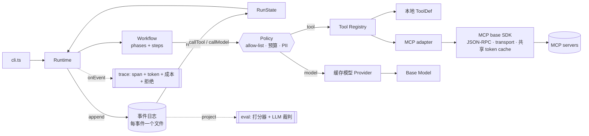

# durable-agent-runtime

一个轻量、依赖少的 **Agent 运行时**，让多阶段 LLM Agent **持久化且可恢复**——灵感来自对一个生产级 Agent 的深入研究，在其基础之上，用更强的可靠性保证重做了**平台层**。

> demo 工作负载（issue → fix agent）刻意做得很薄。本项目的核心是 **运行时本身**：事件溯源状态、崩溃安全恢复、幂等工具调用、可插拔模型 provider，以及一套共享的 MCP base SDK。

---

## 为什么存在

很多 Agent 通过**覆盖单个快照文件**（"checkpoint"）来持久化进度。这种方案在两个场景下会出问题：写入中途崩溃导致状态损坏，以及恢复时不得不重新执行那些不该重复的副作用。本运行时采用事件溯源方案来彻底解决这两个问题：

| 关注点 | 快照 / 覆盖 checkpoint | 本运行时（事件溯源） |
|---|---|---|
| 持久化 | 覆盖一个 JSON blob | Append-only 事件日志，每个事件一个独占创建的文件 |
| 状态 | 直接存储（可能写一半就损坏） | 通过纯 reducer 对事件做 fold，**派生**出状态 |
| 崩溃安全 | 部分写入可能损坏状态 | 崩溃留下的是可重放的有效**前缀** |
| 恢复 | 从粗粒度的 "phase/step" 标记重跑 | 重放日志 → 从第一个未完成的 step 继续 |
| 重复副作用 | 恢复时工具重新执行 | **幂等**：已完成的工具调用被重放，不重新执行 |
| 可审计性 | 只有最后一个状态 | 完整有序历史（时间旅行 / 调试） |

---

## 架构



这个边界是有意划分的：`src/` 下的一切是**运行时（平台）**，对 "issue" 或 "fix" 一无所知；`src/app/` 下的一切是 **demo 工作负载**，可以整体替换而不动运行时一行代码。

### 运行时 — 平台层 (`src/`)

- **事件日志** ([src/eventlog.ts](src/eventlog.ts)) — append-only；每个事件一个独占创建的文件（乐观并发）。以目录方式组织，支持 `listRunIds()` 列出所有 run。
- **Reducer** ([src/reducer.ts](src/reducer.ts)) — 纯函数 `(state, event) => state`；构建状态的唯一途径。`AgentEvent` 是 13 种事件类型的 discriminated union。
- **Runtime** ([src/runtime.ts](src/runtime.ts)) — 驱动工作流、追加事件、从日志恢复，用确定性 `callId` 让工具调用幂等。支持 `run()` / `resume()` / `status()` / `trace()` / `recover()`。
- **快照** ([src/snapshot.ts](src/snapshot.ts)) — 周期性状态快照，用于快速恢复。原子写入（tmp + rename），加载时校验完整性；损坏的快照会被忽略并回退到事件重放。
- **工作流契约** ([src/workflow.ts](src/workflow.ts)) — `WorkflowDef` / `PhaseDef` / `StepDef` / `StepContext` 类型，描述*工作流长什么样*。运行时驱动任何符合此形状的工作流，对 demo 一无所知。
- **模型 Provider** ([src/model/provider.ts](src/model/provider.ts)) — 可换的 LLM；mock 是确定性的，用于离线开发和稳定测试。
- **响应缓存** ([src/model/caching.ts](src/model/caching.ts)) — `CachingModelProvider` 装饰器：内容寻址（规范化 prompt → sha256），LRU 淘汰，可选文件持久化。在一次次的 run 之间削减重复 prompt 的 token 消耗和成本。
- **定价** ([src/pricing.ts](src/pricing.ts)) — 配置驱动（`agent.config.json`）的 token 定价，供 trace 做成本汇总。
- **工具注册表** ([src/tools/registry.ts](src/tools/registry.ts)) — 遵循 MCP 规范的 `ToolDef` / `ToolRegistry` 契约，本地工具和远程 MCP 工具在运行时眼里完全一样。
- **声明式策略层** ([src/policy.ts](src/policy.ts)) — 可复用的护栏中间件，作用于统一的工具/模型调用通道：以数据声明 `Policy`（工具 allow-list · 成本预算 · PII 脱敏）。拒绝操作记录为 `PolicyDenied` 事件，护栏可观测、可 eval 测试——而不是硬编码在 server 代码里。
- **共享 MCP base SDK** ([src/mcp/](src/mcp/)) — 把每个 MCP server 都要重复实现的横切逻辑一次性提取出来：JSON-RPC 框架、可替换 transport、**共享** token cache。adapter 把 server 的工具投影进 `ToolRegistry`，让 N 个 server 共享一个 client + 一个 auth cache，而不是每个 server 各自实现一遍 curl / JSON-RPC / token 缓存。
- **Trace 可观测性** ([src/trace.ts](src/trace.ts)) — 从事件日志派生 span 时间线 + token / 成本 / 延迟汇总。统计持久化重放的关键指标：`replayHitRate`、`cachedModelCalls`、`costSavedUsd`。
- **Eval 框架** ([src/eval.ts](src/eval.ts)) — 可组合打分器（程序化打分 + LLM 裁判）+ runner，对派生出的 RunState / trace 打分；`agent eval` 发现回归时以非零退出码退出。
- **内置 Agent 循环** ([src/agent-loop.ts](src/agent-loop.ts)) — 运行时内置的模型驱动 Agent 循环（比 harness 更简单，但核心概念相同）。模型每 turn 决定 `call_tool` 或 `finish`。封装为单个 durable workflow step。通过 `AGENT_LOOP=1` 启用。
- **CLI** ([src/cli.ts](src/cli.ts)) — 命令行入口。命令：`run`、`resume`、`status`、`recover`、`trace`、`eval`。多种执行模式通过环境变量切换：`HARNESS=1`（harness 循环）、`AGENT_LOOP=1`（内置循环）、默认（固定工作流）。

### Demo 工作负载 — Agent (`src/app/`)

- **Harness 适配器** ([src/app/harness-adapter.ts](src/app/harness-adapter.ts)) — ★ **关键集成**。在 `StepContext` 上实现 `ChatModel` + `ToolInvoker`，转发 harness 的 `key`。`createHarnessWorkflow()` 把 `runAgent` 封装为单个 durable step。启用方式：`HARNESS=1`。
- **工作流** ([src/app/issue-workflow.ts](src/app/issue-workflow.ts)) — `issue → fix` Agent，声明为 `analyze → locate → propose` 三个阶段。
- **工具** ([src/app/tools.ts](src/app/tools.ts)) — 确定性的 mock 工具 `getIssue` / `searchCode`。设置 `AGENT_MCP=1` 可通过 MCP base SDK 提供同一批工具——运行时完全无法区分。
- **模型响应** ([src/app/responses.ts](src/app/responses.ts)) — 为 mock 模型预设的确定性输出。`AGENT_REGRESS=1` 会故意降级输出质量，用于验证 eval 框架能否捕获回归。
- **Eval 场景** ([src/app/scenarios.ts](src/app/scenarios.ts)) — demo 的测试场景 + 预期结果，供 eval 框架打分。
- **Agent 场景模型** ([src/app/agent-scenario.ts](src/app/agent-scenario.ts)) — 内置 agent 循环的确定性 mock 模型大脑：`getIssue` → `searchCode` → `finish`。

---

## 快速开始

```bash
npm install
npm run build
npm test          # 包含崩溃恢复的耐久性测试

# 运行 agent
npm run dev -- run "Login page crashes with a null session"
```

### Demo：崩溃后恢复（核心亮点）

```bash
# 1. 在代码搜索步骤后强制崩溃。记下打印的 run id。
CRASH_AFTER=locate.1 npm run dev -- run "Login page crashes with a null session"

# 2. 恢复 — 重放日志，跳过已完成的工作，不会重复执行已成功的
#    searchCode 工具调用，直接继续完成。
npm run dev -- resume <run-id>

# 3. 随时查看派生的状态。
npm run dev -- status <run-id>
```

每个 run 是按序号编号的事件文件目录（每个事件一个 JSON）：

```bash
ls .agent-runs/<run-id>/   # 000000000000.json, 000000000001.json, ...
```

### Demo：声明式护栏（allow-list · 预算 · PII）

```bash
# 策略以数据形式定义在 agent.config.json 中。eval 包含一个护栏场景：
# 故意缩小预算，来验证运行时确实会*拒绝*超支调用（记录 PolicyDenied 事件并使 run 失败）
# —— 而不只是"配了一个预算放在那里"。
npm run dev -- eval        # "cost-budget guardrail halts a runaway agent" → PASS
```

### Demo：通过共享 MCP base SDK 提供工具

```bash
# 通过 JSON-RPC + 共享 token cache 提供同样的 getIssue/searchCode 工具。
# 结果与本地路径完全一致——运行时无法区分。
AGENT_MCP=1 npm run dev -- run "Login page crashes with a null session"
# > tools via MCP base SDK — 2 servers sharing 1 auth fetch
```

### Demo：多种 Agent 循环模式

```bash
# 默认：固定工作流 (analyze → locate → propose)
npm run dev -- run "Login page crashes with a null session"

# 内置 agent 循环：模型驱动，每 turn 自主决定
AGENT_LOOP=1 npm run dev -- run "Login page crashes with a null session"

# Harness 循环：完整的 A/B/C/D 四层 agent 大脑
HARNESS=1 npm run dev -- run "Login page crashes with a null session"
```

### Demo：trace 与成本分析

```bash
# 查看完整的时间线、token 消耗和成本
npm run dev -- trace <run-id>

# 包含重放命中率、缓存节省等持久化统计
```

### Demo：恢复损坏的 run

```bash
# 如果乐观并发冲突导致 run 卡住，recover 会修复
npm run dev -- recover <run-id>
```

---

## 值得解释的设计决策（面试笔记）

1. **状态是派生出来的，从不持久化存储。** Reducer 是纯函数，同样的日志总能重建出同样的状态。恢复就是"把日志重放到最新位置，然后继续执行"。
2. **幂等工具调用。** 每次调用有确定性 id（`<phase>.<step>:<tool>`）。如果日志已有其结果，运行时重放而不重新调用工具——恢复时绝不重复已发生的副作用。
3. **崩溃被精确注入在副作用执行之后、完成事件写入之前。** 这正是朴素 checkpoint 最容易出错的那个时间窗口；我们的测试断言在这个窗口崩溃也不会丢数据。
4. **模型是依赖注入的，不是硬编码调用。** 确定性 mock 支持离线运行、可复现日志、稳定不 flaky 的 eval。
5. **`onEvent` 是可观测性的接入点。** 每次状态转换都流经同一个地方——天然适合挂载 tracing、token/成本核算、指标采集。
6. **两层缓存，刻意这样设计。** 持久化*重放*缓存（按 run 隔离，以日志位置为索引）保证恢复不重复工作；独立的*内容*缓存（跨 run，按规范化 prompt hash 为索引）削减重复 prompt 的成本。两者解决不同问题，且可以叠加组合。
7. **Eval 只是另一种投影。** 打分器读取的是 run 本身已经产生的 RunState / trace（同样来自事件溯源），所以评分本质上就是"读历史"。Eval 在无缓存的全新模型实例上运行，防止过期缓存掩盖回归。
8. **护栏是声明式层，不是 server 代码。** 工具 allow-list、成本预算、PII 脱敏以*数据*形式作用于统一的工具/模型调用通道，同一策略可组合到任何工作流和任何工具上。每次拒绝都是持久的 `PolicyDenied` 事件——这就是为什么 eval 能验证护栏确实*生效*了，而不只是"配置上了"。
9. **一个 MCP base SDK；所有 server 共用它。** JSON-RPC、transport、共享 token cache 一次性提取好。新增一个 server 只需"给 client 配置一个 transport"，而不是"每个 server 重新实现一遍 curl + JSON-RPC + token 缓存"——adapter 让远程工具在运行时眼里和本地工具完全一样。
10. **快照 checkpoint 加速恢复。** 对于长 run，从头重放所有事件可能很慢。运行时会周期性写入派生状态的快照；恢复时优先加载快照，只重放快照之后的事件。快照是纯性能优化——即使损坏或缺失，系统仍可完全从事件日志重建所有状态。

---

## 路线图

- **D2 — 持久化核心** ✅ 事件日志 + reducer + 恢复 + 幂等（本 commit）。
- **D3 — 并发安全** ✅ 乐观并发追加（独占创建）+ `ConflictError` + `recover()` 监管者。
- **D4 — 可观测性** ✅ 每个 phase / step / tool / model 的 span + 通过 `agent trace` 查看 token / 成本 / 延迟汇总；模型调用现在流经运行时（记为 `ModelCalled` 事件 + 恢复时幂等）。
- **D5 — Eval 框架** ✅ 场景 fixtures + 可组合打分器（程序化 + LLM 裁判）对 RunState / trace 打分；`agent eval`（失败时非零退出）。Demo：`AGENT_REGRESS=1 agent eval` 降级 prompt → 框架捕获回归。
- **D6 — 打磨** ✅ 架构文档（本文件）+ 刷新 [TESTING.md](TESTING.md) + 脚本化端到端演示（[demo.ps1](demo.ps1)：run → crash → resume → recover → trace → eval）。
- **D7 — 共享 MCP base SDK** ✅ JSON-RPC + 可换 transport + 共享刷新 token cache（[src/mcp/](src/mcp/)）；adapter 将远程工具投影进 `ToolRegistry`。`AGENT_MCP=1 agent run` 通过它提供 demo 工具且结果一致（一次 auth fetch 跨 server 共享）。
- **D8 — 声明式策略层** ✅ 工具 allow-list / 成本预算 / PII 脱敏（[src/policy.ts](src/policy.ts)）在工具/模型漏斗上执行，记为 `PolicyDenied` 事件并在 `agent trace` 中展示。eval 包含护栏回归场景，断言预算确实中止了 run。
- **D9 — 快照 checkpoint** ✅ 周期性状态快照（[src/snapshot.ts](src/snapshot.ts)）加速恢复；原子写入 + 完整性校验。
- **D10 — 多 Agent 循环模式** ✅ 三种执行模式：固定工作流 / 内置 agent 循环（`AGENT_LOOP=1`）/ harness 循环（`HARNESS=1`），统一在 CLI 下。
- **D11 — Harness 适配器** ✅ `harness-adapter.ts` 将 `runAgent` 封装为单个 durable step，实现 `ChatModel` + `ToolInvoker` 契约并转发幂等 `key`。

## License

MIT
